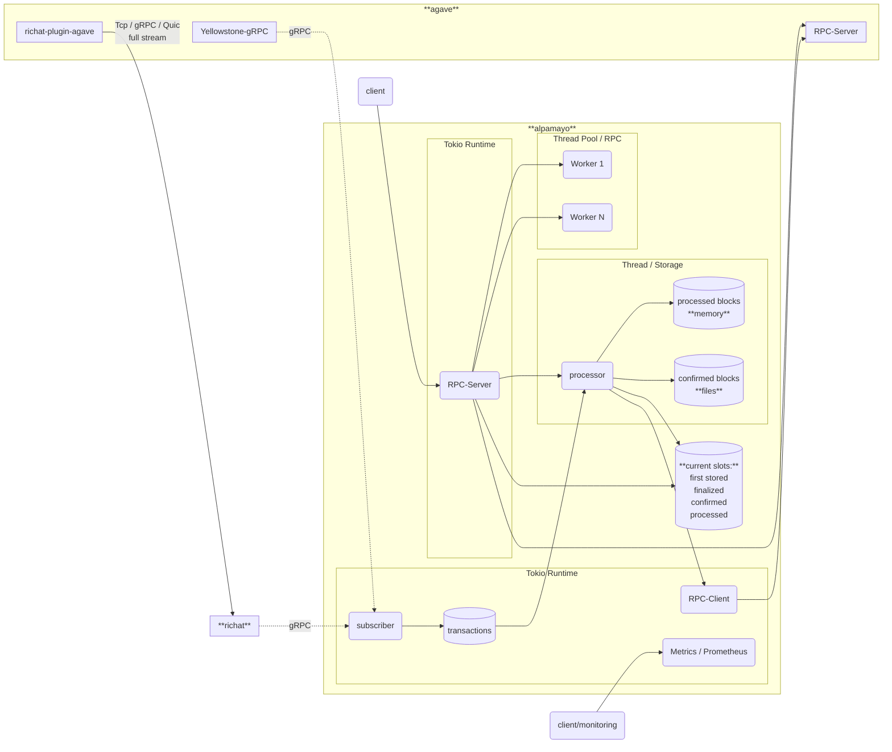

# alpamayo

Lightweight drop-in replacement for the Solana RPC stack, designed for frozen data (blocks, transactions, etc.).

Please use issues only for reporting bugs or discussing feature-related topics. If you're having trouble running alpamayo or need insights about the configuration, please post your question in the Telegram group: [https://t.me/lamportsdev](https://t.me/lamportsdev)

## Sponsored by

## Supported methods

### Solana Rpc methods:

- [x] `getBlock`
- [x] `getBlockHeight`
- [x] `getBlocks`
- [x] `getBlocksWithLimit`
- [x] `getBlockTime`
- [x] `getLatestBlockhash`
- [x] `getRecentPrioritizationFees`
- [x] `getSignaturesForAddress`
- [x] `getSignatureStatuses`
- [x] `getSlot`
- [x] `getTransaction`
- [x] `getVersion`
- [x] `isBlockhashValid`

### Extra methods:

- [x] `/block/${slot}`
- [x] `/tx/${signature}`
- [x] `/version`

## Blueprint

