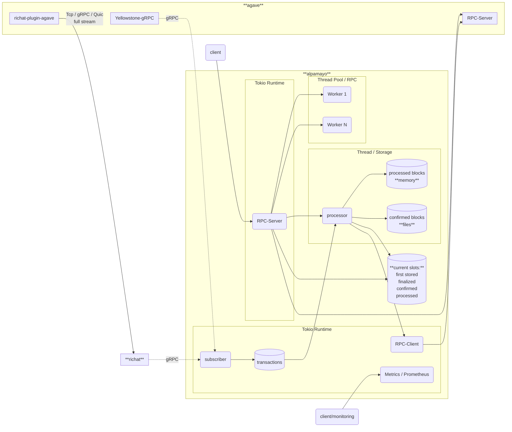

# alpamayo

Lightweight drop-in replacement for the Solana RPC stack, designed for frozen data (blocks, transactions, etc.).

## Sponsored by

## Licensing

The project is dual-licensed: the open-source version uses the `AGPL-3.0-only` license, while the private version is licensed under a [commercial license](https://gist.github.com/fanatid/13f3d557c89efbf3b0c32a2d07345444#file-commercial-license-md).

## Alpamayo support and enterprise version

Please use issues only for bug or feature-related topics. If you're having trouble running alpamayo or need insights about the configuration, please drop your question in the Telegram chat: [https://t.me/lamportsdev](https://t.me/lamportsdev)

In addition to the open-source version there also private version with **[Prometheus](https://prometheus.io/) metrics** and ability to **stream raw blocks in protobuf** (with full access to code). To get more info please send email to: [customers@lamports.dev](mailto:customers@lamports.dev)

<details>
<summary>metrics example (click to toggle):</summary>

```
TODO
```
</details>

## Supported methods

### Solana Rpc methods:

- [x] `getBlock`
- [ ] `getBlockHeight`
- [ ] `getBlocks`
- [ ] `getBlockTime`
- [ ] `getLatestBlockhash`
- [ ] `getRecentPrioritizationFees`
- [ ] `getSignatureStatuses`
- [x] `getSlot`
- [ ] `getTransaction`
- [ ] `getTransaction`
- [ ] `getVersion`
- [ ] `isBlockhashValid`

### Extra methods:

- [ ] `getBlockProtobuf`
- [ ] `getVersionAlpamayo`

## Blueprint


